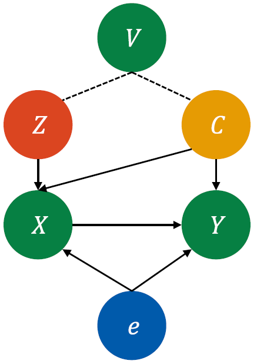

# AutoIV

## Introduction

This repository contains the implementation code for paper:

**Auto IV: Counterfactual Prediction via Automatic Instrumental Variable Decomposition**

Junkun Yuan, Anpeng Wu, Kun Kuang, Bo Li, Runze Wu, Fei Wu, Lanfen Lin

*ACM Transactions on Knowledge Discovery from Data (TKDD), 2022*

[[arXiv](https://arxiv.org/abs/2107.05884)]

## Brief Abstract for the Paper

<p align="center">
     <br>
</p>

Instrumental Variable (IV) is a powerful tool for causal inference, but it is hard to find/pre-define valid IVs. We propose an Automatic Instrumental Variable decomposition (AutoIV) algorithm to generate IV representations from observed variables through mutual information constraints for IV-based counterfactual prediction.

## Requirements

You may need to build suitable Python environment for the experiments.

The following package versions are recommened.

* python 3.6
* tensorflow-gpu 1.15.0

Device:

* GPU with VRAM > 3GB (strictly).
* Memory > 4GB.

## Usage

1. Configure ***run.sh*** file.
2. Run the code with command:

```
nohup sh run.sh > run.txt 2>&1 &
```

3. Your may check the results in the following path:

| Information                 | Path to check                                                                               | Note                                                                                                                                                                                                                                                                                                                                                                      |
| --------------------------- | ------------------------------------------------------------------------------------------- | ------------------------------------------------------------------------------------------------------------------------------------------------------------------------------------------------------------------------------------------------------------------------------------------------------------------------------------------------------------------------- |
| Generated synthetic data    | ***data/`dataset`/`dataset`-train_`data_num`/***                                            | x: treatment; y: structural response; ye: true outcome.                                                                                                                                                                                                                                                                                                             |
| Generated IV representation | ***data/`dataset`/autoiv-`dataset`/autoiv-`dataset`-train_`data_num`-rep_`rep_dim`/data/*** | col 1: x treatment;<br />col2: x_pre treatment predicted by treatment network;<br />col 3: y true outcome;<br />col 4: y_pre outcome predicted by outcome network;<br />col 5~{4+`rep_dim`}: IV representation Z;<br />col {5+`rep_dim`}~{4+2*`rep_dim`}: confoudner representation C. |
| Training details of AutoIV  | ***AutoIV-results/`dataset`-train_`data_num`-date/***                                       | Trace of Loss and MSE error of training, validation, and test data during training.                                                                                                                                                                                                                                                                     |

## Updates

- [01/13/2022] We have updated our arXiv version. See https://arxiv.org/abs/2107.05884.
- [01/09/2022] Our work is published on TKDD 2022. See https://dl.acm.org/doi/10.1145/3494568.

## Citation

If you find our code or idea useful for your research, please consider citing our work.

```bib
@article{yuan2022auto,
  title={Auto IV: Counterfactual Prediction via Automatic Instrumental Variable Decomposition},
  author={Yuan, Junkun and Wu, Anpeng and Kuang, Kun and Li, Bo and Wu, Runze and Wu, Fei and Lin, Lanfen},
  journal={ACM Transactions on Knowledge Discovery from Data (TKDD)},
  volume={16},
  number={4},
  pages={1--20},
  year={2022},
  publisher={ACM New York, NY}
}
```

## Contact

If you have any questions, feel free to contact us through email (yuanjk@zju.edu.cn or anpwu@zju.edu.cn) or GitHub issues. Thanks!
